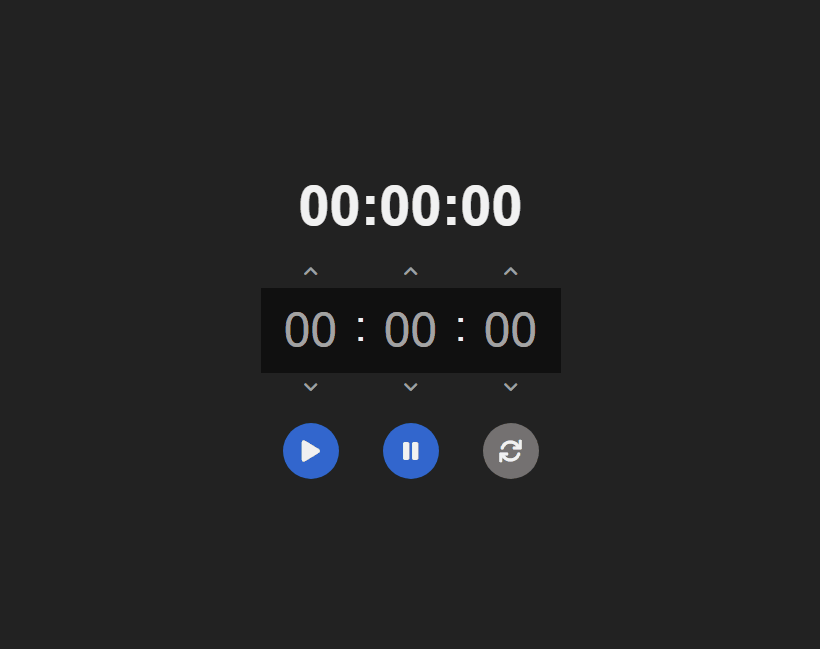

# ⚙️ Projeto
Projeto consiste em um cronometro, desenvolvido por mim, no intuito de praticar o que tenho estudado sobre React, como a organização dos arquivos, hooks personalziados, etc... e poder explorar mais sobre o styled-components.

# ✈️ Tecnologias
- <a href="https://pt-br.reactjs.org/">ReactJS</a>
- <a href="https://fontawesome.com/">Font Awesome</a>
- <a href="https://styled-components.com/">Styled Components</a>

# 🖥️ Resultado

  
  
Confira o resultado: <a href="https://cronometro-react-ruuuff.netlify.app/">Cronometro React</a>

